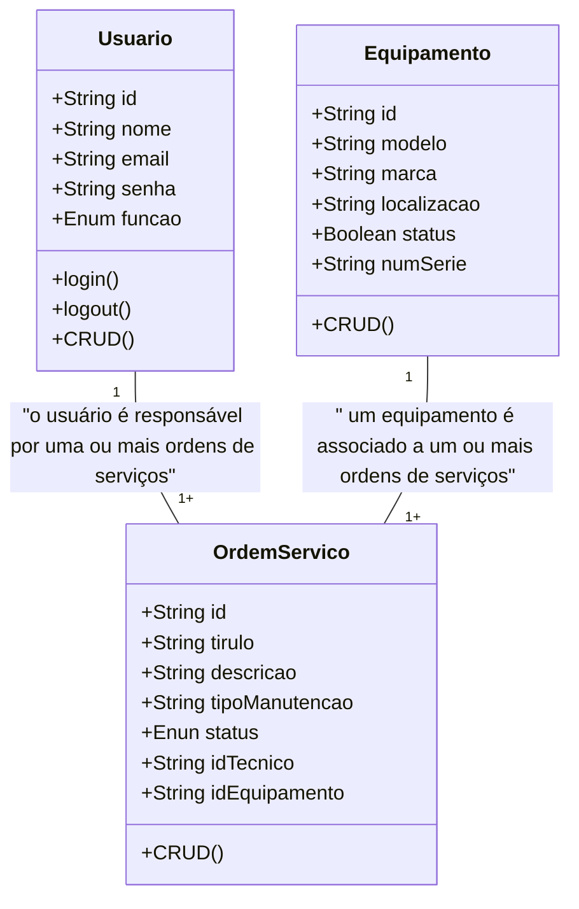
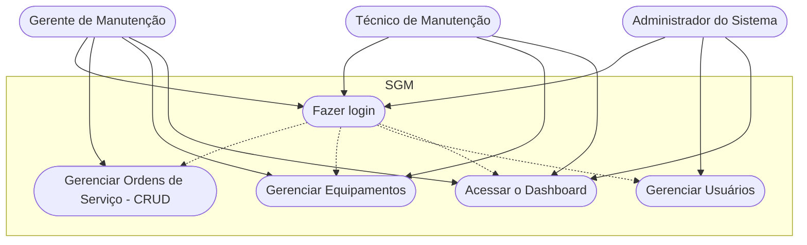

# Sistema de Gestão de Manutenção (SGM)

## Briefing
O projeto consiste no desenvolvimento de um Sistema de Gestão de Manutenção (SGM) no formato de uma aplicação web. O objetivo é centralizar e otimizar o controle das atividades de manutenção de máquinas e equipamentos de uma empresa. A plataforma permitirá o cadastro de equipamentos, agendamento de manutenções preventivas e corretivas, e o gerenciamento de ordens de serviço.

## Objetivos do Projeto
- Gerenciar informações sobre equipamentos e manutenção realizadas pela empresa
- Realizar abertura de chamados de manutenção (ordens de serviço)
- dashboard de históricos de manutenção
- Proteger acesso aos dados do sistema (criptografia e autenticação segura de usuários)

## Público-Alvo
- Técnicos de Manutenção (usuários finais)
- Gestores de Manutenção (usuários intermediários)
- Administradores do Sistema (Gerenciar a permissão dos usuários)

## Levantamento de Requisitos do Projeto
- ### Requisitos Funcionais
    
- ### Requisitos Não Funcionais

## Recursos do Projeto
- ### Tecnológicos 
    - Framework de Desenvolvimento Next/ React
    - Linguagem de Programação: TypeScript
    - Banco de Dados: Não Relacional (MongoDB)
    - GitHub
    - VsCode
    Figma

- ### Pessoal
    - Dev Tudo

## Análise de Risco

## Diagramas

1. ### Diagrama de classe 
Descreve o Comportamento das Entidades de um Projeto (Aquelas informações que serão armazenadas no banco de dados)

    - Usuário (User)
        - Atributos: id, nome, email, senha, função
        - Métodos: create, read, update, delete, login, logout 

    - Equipamento (Equipment)
        - Atributos: id, modelo, marca, localiza, status, numero/Série
        - Métodos: CRUD

    - Ordem de Serviço (OrdemServico)
        - Atributos: id, titulo, descrição, tipoManutenção, status, idTecnico, IdEquipamento




2. ### Caso de Uso
Ilustra as interações dos diferentes tipos de usuários (Atores) com as funcionalidades do sistema

    - Técnico: Gerenciar Ordens de Serviço (CRUD) e acessar o dashboard;
    - Gerente: Funções do técnico + Gerenciamento de Equipamentos (CRUD);
    - Admin: Gerenciar os Usuários do Sistema e acessar o Dshboard

    Fazer o login -> Antes de qualquer ação



3. ### Fluxo
Detalha o passo a passo para realizar uma ação no sistema

- Diagrama de Fluxo de login
    - O usuário acessa a tela de login
    - Insere as credenciais
    - O sistema verifica as Credenciais 
        - se sim: gera um JWT (Token) => Dashboard
        - se não: manda uma mensagem de erro - Permanece na tela de Login

````mermaid

graph TD
    A[Início] --> B{Acessa a Tela de Login}
    B --> C[Preencher Email e Senha]
    C --> D{Validar as Credencias}
    D --> SIM --> E[Gerar um Token JWT]
    E --> F[Dashboard]
    D --> NÃO --> G[Mensagem de Erro]
    G --> E
```