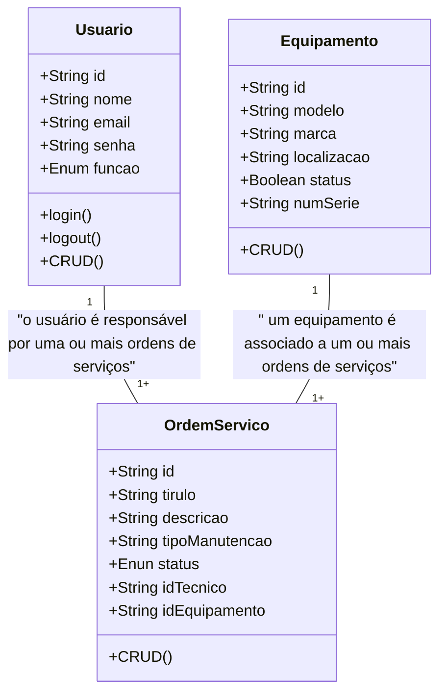
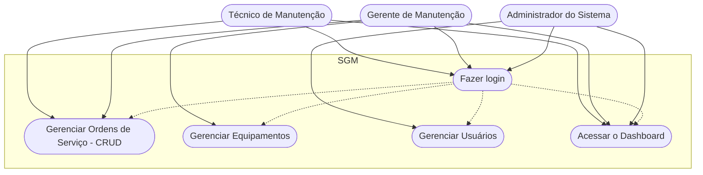

# Gerenciador de Tarefas para Times (Estilo Kanban) - Formativa

## Briefing
O projeto consiste no desenvolvimento de um Gerenciador de Tarefas no formato de uma aplicação web. O objetivo é organizar e centralizar o fluxo de trabalho de equipes, fornecendo uma visão clara das tarefas que precisam ser feitas, das que estão em andamento e das já concluídas, através de um quadro Kanban.

## Objetivos do Projeto
 - Gerenciar projetos e tarefas de forma centralizada.

 - Permitir o CRUD de projetos.

 - Permitir o CRUD de tarefas (título, descrição, projeto associado, membro atribuído, status).

 - Visualizar tarefas em um quadro Kanban.

 - (Bônus) Implementar drag-and-drop para movimentação de tarefas entre colunas.

## Público-Alvo
- Gerente de Projeto.
- Membro da Equipe.

## Levantamento de Requisitos do Projeto
- ### Requisitos Funcionais
 - RF01 – Login e autenticação de usuários com JWT.

 - RF02 – Gestão de usuários (Admin pode criar/editar/remover e definir papéis).

 - RF03 – Controle de acesso por perfis (Técnico, Gerente, Admin).

 - RF04 – CRUD de equipamentos.

 - RF05 – CRUD de ordens de serviço (abertura, edição, fechamento).

 - RF06 – Fluxo de status das ordens (Aberta, Em andamento, Concluída, etc).

 - RF07 – Dashboard com histórico de manutenções.

 - RF08 – Visualização em quadro Kanban das ordens de serviço
    
- ### Requisitos Não Funcionais
 - RNF01 – Segurança: senhas criptografadas (bcrypt), autenticação via JWT e HTTPS.

 - RNF02 – Usabilidade: interface simples, responsiva e intuitiva.

 - RNF03 – Performance: respostas rápidas nas consultas (até 500ms em média).

 - RNF04 – Manutenibilidade: código organizado em TypeScript, uso de boas práticas.

 - RNF05 – Disponibilidade: sistema acessível em navegadores modernos (Chrome, Edge, Firefox).

 - RNF06 – Backup: dados armazenados em MongoDB com rotina de backup.

## Recursos do Projeto
- ### Tecnológicos 
    - Framework de Desenvolvimento Next/ React
    - Linguagem de Programação: TypeScript
    - Banco de Dados: Não Relacional (MongoDB)
    - GitHub
    - VsCode
    Figma

- ### Pessoal
    - Dev Tudo

## Análise de Risco

### Riscos Técnicos
 - R1 – Falhas de Autenticação/Autorização
Impacto: alto — pode expor dados sensíveis.
Mitigação: uso de JWT, bcrypt e testes de segurança.

 - R2 – Perda de Dados no Banco (MongoDB)
Impacto: alto — perda de histórico de ordens de serviço.
Mitigação: backups regulares e ambiente de teste separado.

 - R3 – Baixa Performance em Consultas
Impacto: médio — sistema lento para usuários.
Mitigação: índices no MongoDB e otimização de queries.

### Riscos de Projeto
 - R4 – Escopo Muito Amplo
Impacto: médio — risco de não entregar no prazo.
Mitigação: foco no MVP (CRUDs, Kanban básico, autenticação).

 - R5 – Falta de Testes
Impacto: alto — bugs em produção.
Mitigação: testes manuais + unitários básicos antes da entrega.

### Riscos de Usabilidade
 - R6 – Interface Complexa
Impacto: médio — usuários não adotam a solução.
Mitigação: design simples e responsivo, foco em usabilidade.

## Diagramas

1. ### Diagrama de classe 
Descreve o Comportamento das Entidades de um Projeto (Aquelas informações que serão armazenadas no banco de dados)

    - Usuário (User)
        - Atributos: id, nome, email, senha, função
        - Métodos: CRUD, login, logout

    - Projeto
        - Atributos: id, modelo, marca, localiza, status, numero/Série
        - Métodos: CRUD

    - Ordem de Serviço (OrdemServico)
        - Atributos: id, titulo, descrição, tipoManutenção, status, idTecnico, IdEquipamento




2. ### Caso de Uso
Ilustra as interações dos diferentes tipos de usuários (Atores) com as funcionalidades do sistema

    - Técnico: Gerenciar Ordens de Serviço (CRUD) e acessar o dashboard;
    - Gerente: Funções do técnico + Gerenciamento de Equipamentos (CRUD);
    - Admin: Gerenciar os Usuários do Sistema e acessar o Dshboard

    Fazer o login -> Antes de qualquer ação



3. ### Fluxo
Detalha o passo a passo para realizar uma ação no sistema

- Diagrama de Fluxo de login
    - O usuário acessa a tela de login
    - Insere as credenciais
    - O sistema verifica as Credenciais 
        - se sim: gera um JWT (Token) => Dashboard
        - se não: manda uma mensagem de erro - Permanece na tela de Login

````mermaid

graph TD
    A[Início] --> B{Acessa a Tela de Login}
    B --> C[Preencher Email e Senha]
    C --> D{Validar as Credencias}
    D --> SIM --> E[Gerar um Token JWT]
    E --> F[Dashboard]
    D --> NÃO --> G[Mensagem de Erro]
    G --> E
```